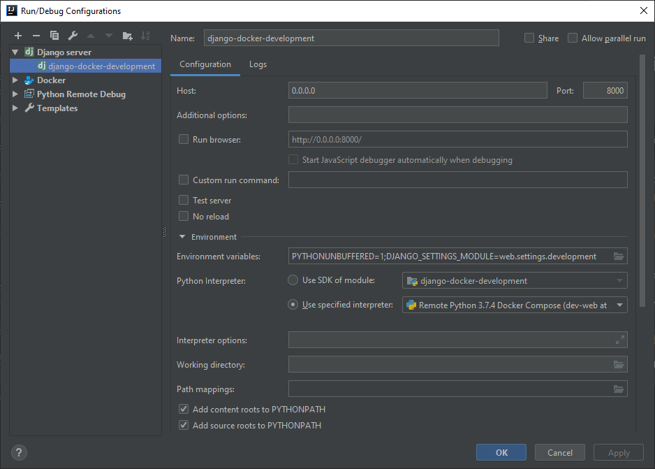

# django-docker-development
[](https://github.com/psf/black)

This project is an example that combining Django Rest Framework with PostgreSQL and allows you to develop inside the docker containers. 


## Requirements

* Docker 2.0.0.2 or more
* Docker-compose 1.23.2 or more


## Stack

* Python 3.7
* Django 2.2.13
* Django Rest Framework 3.10.3
* psycopg2 2.8.5
* Black 19.10b0
* Pytest 5.4.3


## Before run

Create a volume for a database: 
```
docker volume create dev-db-volume
```


## Run

To start the Django REST server, use the following command in the project folder:
```
docker-compose up
```
After that app should be up on http://localhost:8000 in development mode (with automatic update).


## Run/Debug in Intellij Idea or PyCharm

To run/debug this project in Intellij Idea or PyCharm you need to do the follow actions:

* Remove the `python manage.py runserver 0.0.0.0:8000` in file `entrypoint.sh`
* Rebuild docker image for `dev-web` service:
```
docker-compose build dev-web
```
* `Project Structure...` or `Ctrl + Alt + Shift + S` > `Project` > Add new `Python SDK` with the following options:


* Configure the `Run/Debug Configurations` as in the picture below:



Now you can run the project in debug mode using the previously created configuration.


## Code style

To reformat all code in the project run the follow command:
```
black web --exclude web/settings
```

To check whether the code can be reformatted run the follow command:
```
black web --check --exclude web/settings
```
